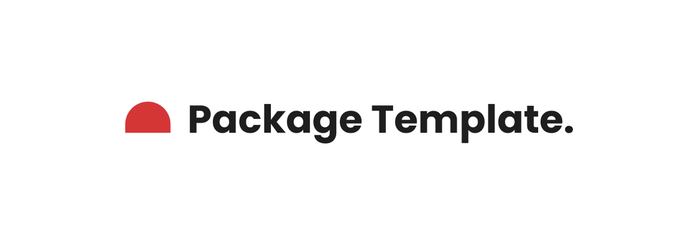

<p align="center">
    
    <p align="center">
        <a href="https://github.com/codelabmw/package-name/actions"></a>
        <a href="https://packagist.org/packages/codelabmw/package-name"></a>
        <a href="https://packagist.org/packages/codelabmw/package-name"></a>
        <a href="https://packagist.org/packages/codelabmw/package-name"></a>
    </p>
</p>

A description of what the package is and what it does.

## Installation

> Requires PHP ^8.3

You can install the package via composer:

```bash
composer require codelabmw/package-name
```

## Usage

Instructions on how the package should and can be used including code examples.

```php
<?php

declare(strict_types=1);

namespace Codelabmw\Package;

final class Example
{
    /**
     * Creates Example instance.
     */
    public function __construct(private readonly Package $package)
    {
        $package->doSomething();
    }
}
```

## Changelog

Please see [CHANGELOG](CHANGELOG.md) for more information on what has changed recently.

## Contributing

Please see [CONTRIBUTING](CONTRIBUTING.md) for details.

## Credits

- [Chikondi Kamwendo](https://github.com/kondi3)
- [All Contributors](../../contributors)

## License

The MIT License (MIT). Please see [License File](LICENSE.md) for more information.